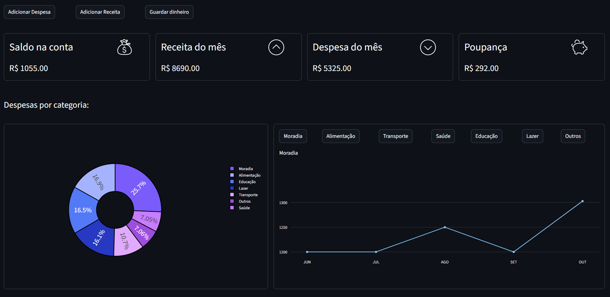
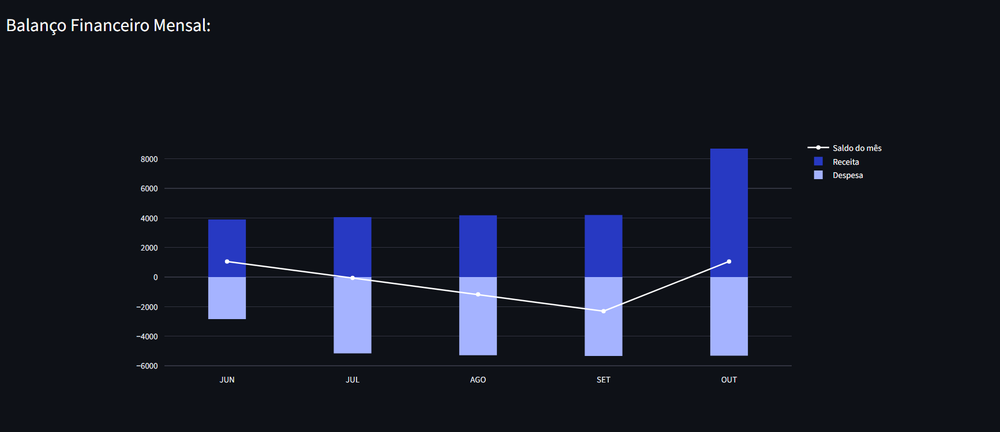
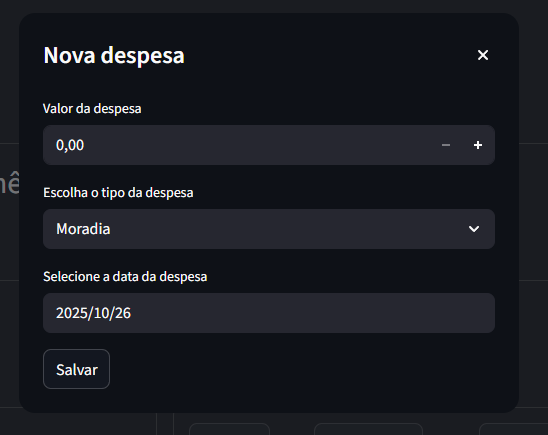
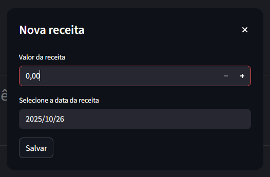
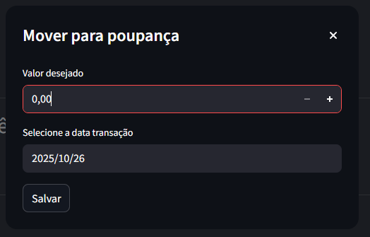

<h1 align="center">
Dashboard de Controle Financeiro
</h1>

<h3 align="center">
    Tour pelo dashboard &bull;
    Como executar o projeto &bull;
    Documentação &bull;
    Créditos
</h3>

<p>
O projeto foi desenvolvido com o objetivo de aprimorar minhas habilidades em análise e visualização de dados, aplicando esses conhecimentos ao controle financeiro pessoal. O Projeto consiste em um dashboard criado em Python, com interface construída em Streamlit e tratamento de dados realizado com Pandas.<br>
</p>

## ✈️Tour pelo dashboard

<h3>Overview</h3>




<p>A interface do dashboard possui as seguintes funcionalidades:</p>

<ul>
    <li>Botões no cabeçalho para adicionar uma nova receita ou despesa, além de transferir dinheiro da conta para a poupança.</li>
    <li>Seções que apresentam as informações do saldo total da conta, das receitas e despesas do mês, e do saldo total da poupança.</li>
    <li>Gráfico de pizza das despesas, permitindo que o usuário visualize onde está concentrada a maior parte de seus gastos.</li>    
    <li>Gráfico comparando cada tipo de despesa ao longo do tempo, com botões no cabeçalho para alterar o gráfico em análise.</li>
    <li>Gráfico que compara o crescimento das despesas e das receitas ao longo dos meses.</li>
</ul>

<h3>Inserir novos dados</h3>

<div align="center">
    
    
    
</div>

<p>
O processo de inserir novos dados é bem simples.<br> No cabeçalho do dashboard, encontramos três botões responsáveis por essa função:
</p>
<ul>
 <li><strong>Adicionar Despesas</strong>: ao clicar, é exibido um formulário onde é possível informar o valor, o tipo e a data da despesa;</li> 
 <li><strong>Adicionar Receita</strong>: ao clicar, é exibido um formulário onde é possível informar o valor e a data da receita;</li> 
 <li><strong>Guardar dinheiro</strong>: ao clicar, é exibido um formulário onde é possível informar o valor e a data em que o movimento foi realizado.</li>
</ul>

## 💻Como executar o projeto?
<p>Para executar este projeto, é necessário ter versão mais recente do Python e do pip instaladas em sua máquina</p>

<p>Após garantir isso, podemos:</p>

<ul>
  <li>Clonar o repositório;</li>
  <li>Instalar as dependências do projeto;</li>
  <li>Criar a pasta <code>data</code>.</li>
</ul>

<p>Para cloná-lo, basta inserir o seguinte comando no terminal:</p>

```bash
git clone https://github.com/Lemos1701/dash_finance_control.git
```

<p>Uma vez clonado, abra o projeto em sua IDE de preferência (foi utilizado o VS Code para desenvolver o projeto) e execute o seguinte comando no terminal:</p>

```bash
pip install -r requirements.txt
```
<p>Por fim, crie uma pasta como o nome <code>data</code> na raiz do projeto.</p>

<p>Após isso, você poderá executar o arquivo <code>main.py</code> normalmente.</p>

## 📄Documentação

<h3>Estrutura do projeto:</h3>

<p>Se tudo foi configurado corretamente, a estrutura do seu projeto deverá estar semelhante a esta:</p>

```bash
dash_finance_control/
├── main.py
├── requirements.txt
├── .gitignore
├── readme.md
├── data/
│   ├── savings.csv (Só aparecerá quando tiver dados)
│   └── data.csv (Só aparecerá quando tiver dados)
├── dash/
│   ├── app.py
│   ├── components.py
│   ├── data_manager.py
│   └── kpi.py
└── assets/
    ├── down.png
    ├── expense.png
    ├── income.png
    ├── up.png
    ├── overview_1.png
    ├── overview_2.png
    ├── savings.png
    ├── pig.png
    └── money.png
```

<h3>Explicando a estrutura</h3> 

<p> 
Devido à simplicidade e ao propósito do projeto, não é necessário dividi-lo em front-end e back-end.
A pasta <code>dash</code> concentra todos os scripts responsáveis pelo funcionamento do dashboard.
</p>

<p>Dentro da pasta <code>dash</code>:</p>

<ul>
    <li><code>app.py</code>: contém o script responsável por criar a interface. O Streamlit foi escolhido como framework por ser simples.</li>
    <li><code>components.py</code>: reúne as funções responsáveis por criar todos os gráficos que são exibidos no dashboard. A biblioteca Ploty foi escolhida por oferecer maior liberdade de personalização.</li>
    <li><code>data_manager.py</code>: contém o script responsável pela manipulação dos arquivos CSV.</li>
    <li><code>kpi.py</code>: reúne as "Key Performance Indicators", ou seja, os indicadores de performance utilizadas.</li>
</ul>


<p>
Dentro da pasta raiz do projeto, encontram-se:
</p> 
<ul> 
    <li>
    <code>data</code>: contém os arquivos CSV onde está armazenado os dados;
    </li> 
    <li>
    <code>main.py</code>: responsável por executar o projeto;
    </li>
    <li>
    <code>requirements.txt</code>: contém todas as dependências do projeto.
    </li>
</ul>

## Créditos

<p>Documentação que serviu de inspiração para este projeto:</p>
<ul> 
    <li>
        <a href="https://github.com/jessevig/bertviz/tree/master">https://github.com/jessevig/bertviz/tree/master</a>
    </li> 
</ul>
